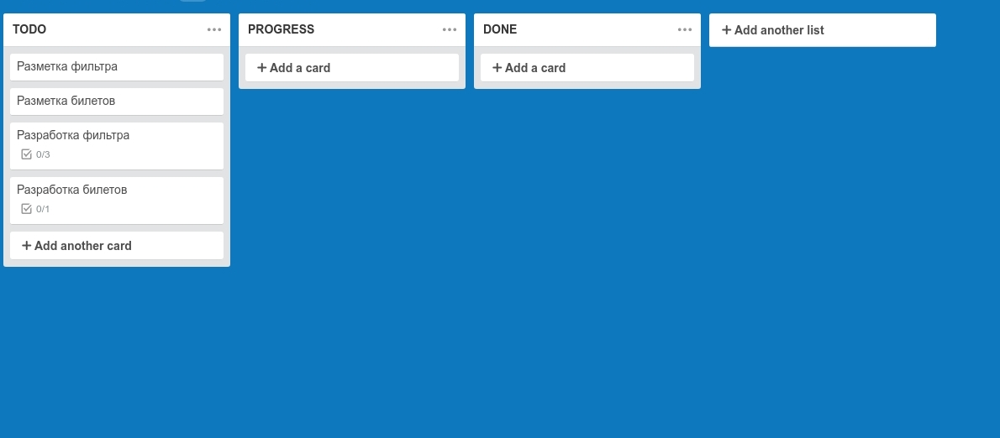
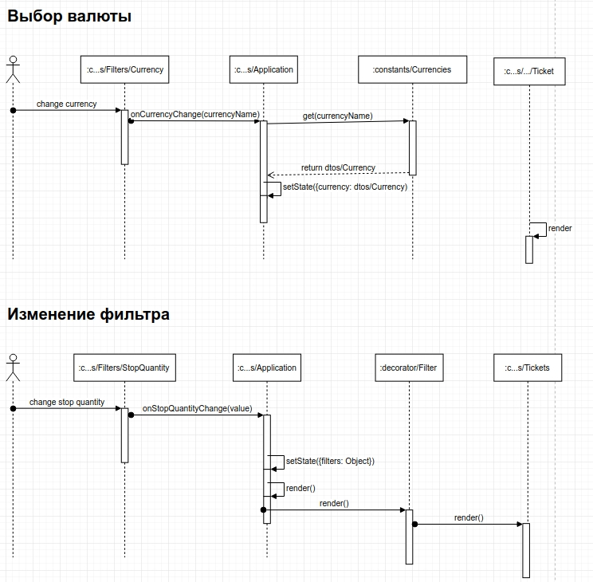

# Aviasearch

Демочка: https://pashaigood.github.io/aviasearch/

# Процесс

## Планировение
Простая декомпозиция, чтобы ничего не забыть.

## Проектровени
Сразу решил не использовать менеджеры состояний, так как объёмы не большие и встроенных в react механизмов вполне достаточно.

Вся магия происходит в `src/containers/Application`, остальные рисуют.
Для реализации изменения валюты испробовал новым context API react.

Накидал +- абстрактную диаграмму последовательностей.

`src/dtos` - Data Transfer Objects, считаю, что данные не должны на прямую рисоваться с сервера,
 а должны быть зарегистрированы и обработаны системой. Также это даёт возможность для дальнейших расширений.

## Разарботка
### Сборка
Для сборки использовал `webpack 4` с небольшой настройкой. 
### Стили
Для стилей выбрал `scss` как препроцессор и `bootsrap 4` в качестве основы, наконец довелось с ним поработать.
С приложением стили связываются через 'Css Modules'. Оказалось, что подружить bs с ними не такая уж и тривиальная задача).
### Код
JavaScript es6+ с такими добавлением, как декораторы и свойска классов.
### Контроль качества
Jest для тестов и standard для качества кода.
Я уважаю TDD, в первую очередь как инструмент разработки, считаю, что не стоит перегибать и с ним тоже. Там где проще протестировать через приёмочные тесты, стоит использовать их.
### Ввод
Приложение залито на gh-pages
